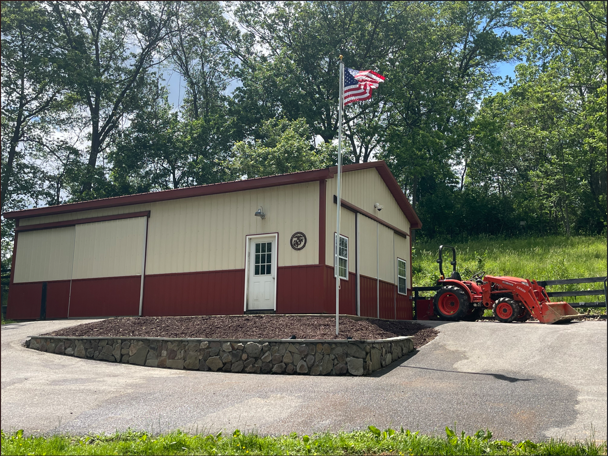

# Retaining Wall Design & Assembly
## 1. CAD Model 
To guarantee long-term integrity of retaining wall and to avoid structural collapse from lateral soil pressure, I created a CAD model "blueprint" before gathering materials to begin project. The blueprint helped decide where to incorporate drainage paths, how to prevent soil from going through drainage paths, and to plan for garden bed.

#2. SOP 
Materials Used

* Cinder blocks (15.5" W x 5.75" L x 7.5" H)
* Capstone (17.5" W x 11.5" L x 1.25" H)
* Quick-setting concrete mix (for setting blocks)
* Grout (for capstone and stone facing)
* Stone veneer/facing (for front of wall)
* Barrier sheeting (behind the wall to keep mulch out)

Construction Steps

1. Preparing base placement by leveling dirt and setting up t-posts at each corner with a string attached to each tip of posts overlapping path for base.
2. prepare concrete mixture for each layer of cinderblock
3. Once cinderblock set, cut foam sheeting to cover the width of two cinderblocks from the inside before backfilling with mulch
4. prepare grout mix
5. Set capstone on top lay of cinderblocks, then grout each stone to top face of cinderblock
6. Set chipped natural stone to front face, covering all visible cinderblocks
8. Check alignment, and stability
9. Finally, backfilled with mulch

#3. Results

Project outcome: 
- finished retaining wall giving the landscape a neat, sturdy border while keeping mulch and soil in place. By combining cinder blocks, stone facing, and a capstone, solved A problem while giving property a natural look

