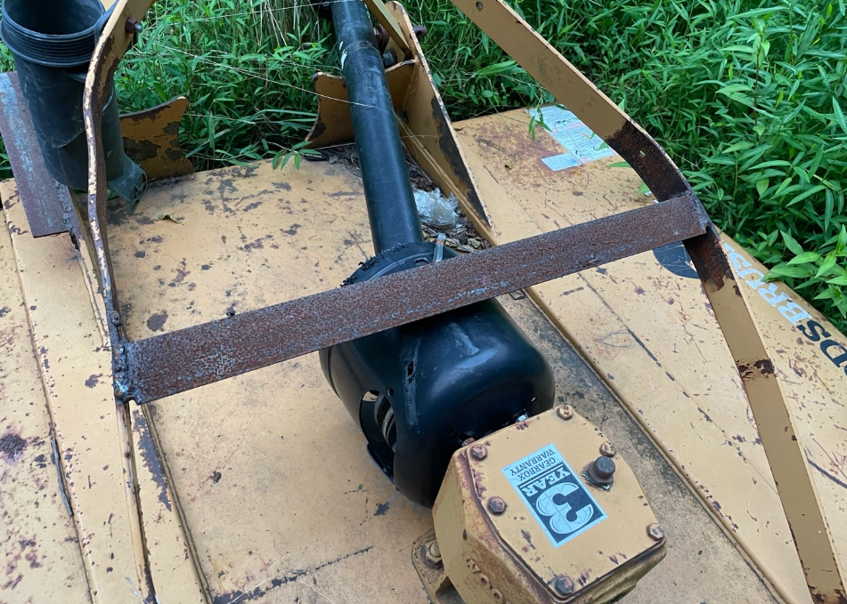

1. Overview ##
- Identified risk concerning structural failure in the support frame of a brush hog. I had noticed the steel side bars that connect to an anchor point for A 3 point hitch attachment bent inwards anytime the it was raised before use. When I looked closer, that side bar seemed to reach about an inch from the gearbox. I Immediately told the person who was running it at the time to shut off the tractor and drop the back attachment releasing any compression, at this point i had noted there would be no further use of the brush-hog until you buy a new support. I was introduced to the project from the owner asking me if i could install a temporary fix to save money.

2. Materials/tools ##
- 20.00" (in) angle iron [$25.53]
- 2 Bessy all steel Clamps, (clamps fixed jaw dimensions: {1.00 x 4.00 x 1.25} in) [$80.12]

3. SOP ##
1. lowered bucket and brush hog to ground level on flat surface relieving hydraulic pressure
2. Once components were at rest I recorded from a top view on camera mount then raised brush-hog identifying bend point in support
3. Mark bend point with red sharpie then measure gap between side bars for required length of angle iron, (subtracted 0.8in to measured length leaving 0.4in gap on each side for weld).
4. Cut angle iron in isolated area and double check surroundings for flammable materials
5. Set clamps on each side bar holding angle iron from both ends preventing “slip” during weld (clamps fixed jaw dimensions: {1.00 x 4.00 x 1.25} in)
6. Ground AMP to sidebar support on side you weld
7. Proceed with weld, alternate sides after having completed one side
8. Set timer after each completed side for 60 seconds, then brush weld with wire brush
9. Let steel set for 20 minutes
10. Test run support structure

4. Results ## 

.png)

     
     -  After dragging 3 layers of steel from angle iron’s surface filling the 0.4 inch gap, I let steel set for 1 minute then applied wire brush to clear oxides and remove any slag preventing internal gaps from forming in the steel. Finally, I let steel sit for 20 minutes allowing steel to reach base temp for the materials max toughness. To test my fixed support, I drove the tractor to a small field to engage the brush hog. During this test, I noticed there was no bend in support bars, I also drove the tractor over uneven ground to ensure support held on elevated surfaces. Overall, I prevented collapse on brush hog motor saving over $2,000 on repair services. I used a total of five 3.25” inch steel rods, each rod costing approximately $0.25. Total service cost was $26.78. 

 

